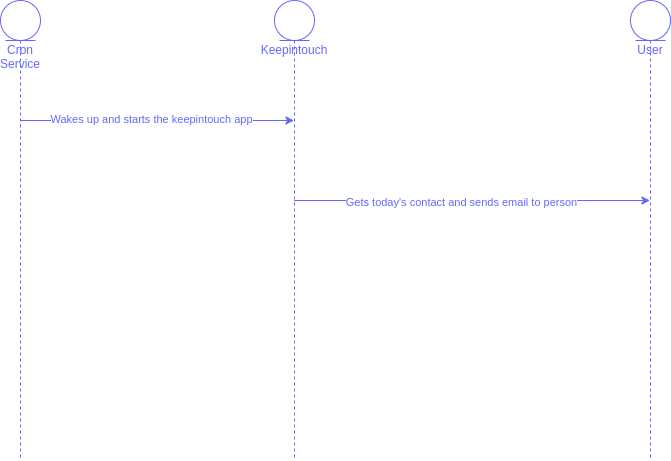

# Keepintouch App

A simple app to keep in touch with friends and family.

## General Requirements
* Remind the user daily to get in touch with a specific person
* Keeps track of the people you have contacted and how frequently
* Can generate a simple report of the people you keep in touch with

## Usage Requirements
* Simple app used by one user at a time
* Manage contacts of up to 1000 people

## API
* adduser(user)
* retrieveUserInfo(user_name)
* addusers(list_of_users)
* todaysContact()

### Data model
* user:
  ```
  name
  phone_number (optional)
  email (optional)
  birthday (optional)
  notes (optional)
  importance_level (required)
  other
  ```
  * Quick question: do we want to include the option for users to define random fields?
    * Follow up to that, how do we make those fields consistent?

* list_of_users:
  * will a json file or csv file work better here?

### Data storage
* It is a simple app. We can use the following:
  * a text file
  * sqlite - let's use this. but it means we will have a rigorous data model
    * we will have some ACID properties though

### Other tasks
* How do we determine the frequency of contact?
  * do we use importance levels and map that to a certain frequency?

* Can user upgrade important people?

* Can user select how many people they want to contact daily?

* How can user give the app quick feedback?

## Architecture



